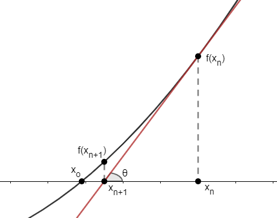

# Newton Raphson Method Implemented in PySpark
## Introduction
This repository is mainly for study purposes. It contains the Python implementation of the algorithm using PySpark. It is a simple version of implementation of the Newton's Method algorithm. It also includes a very basic version of Stochastic Gradient Descent without regularization for comparison.

## Newton Raphson Method Formula
Fundamentally, the Newton Raphson Method (as known as Newton's Method) is to find where the function value is **zero** which is where the curve intercept with the x-axis. Usually, we can just put $f(x)=0$ and solve for $x$. However, it will become more and more difficult once the function is getting more complicated. This is where Newton Raphson Method comes in.

The basic equation of Newton Raphson Method is:

$$
x_{n+1} = x_n - \frac{f(x_n)}{f'(x_n)}
$$

This method is an iterative approach where $x_n$ is any starting point. As we calculated the value of $x_{n+1}$, we are getting more and more closer to where the **zero** value is.

Basically, there are two ways prove this equation: by using **trigonometry** or by using **Taylor Series**.

## Trigonometry Approach

As we can see above, we have a quadratic function $f(x)$ which intersect the x-axis at point $x_0$. We can then take the derivative of $f(x)$ and get $f'(x)$. Suppose we start from some point $x_n$ and draw a tangent line at $x_n$ and intersect the x-axis at $x_{n+1}$. Here we can see that we are mucher closer to our target $x_0$. Then, we simply repeat the same procedure to get closer and closer to the target.

You may ask how can we obtain the value of $x_{n+1}$. It is very simple by using trigonometry. We can clearly see there is a right triangle constructed by the tangent line, so we will have:

$$
\tan{\theta}=\frac{f(x_n)}{\Delta x}, \text{ where } \Delta x=x_n - x_{n+1}
$$

The value of $\tan{\theta}$ can be obtained by the slope of the tangent line which is $f'(x_n)$. Thus, we can change our equation to:

$$
\begin{align}
f'(x_n) &= \frac{f(x_n)}{x_n - x_{n+1}} \\
x_n - x_{n+1} &= \frac{f(x_n)}{f'(x_n)} \\
x_{n+1} &= x_n - \frac{f(x_n)}{f'(x_n)}
\end{align}
$$

which is exactly the formula of Newton Raphson Method.

## Taylor Series Approach
